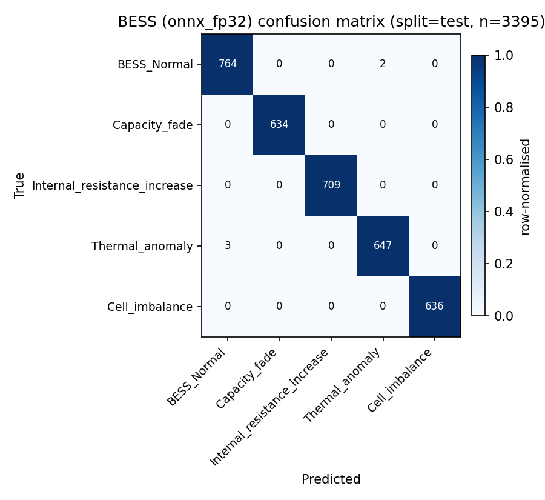

# AgentPV Component 3 — BESS `onnx_fp32` evaluation summary

- **Variant**: `onnx_fp32`
- **Model artefact**: `C:\Users\Mansycc\Desktop\omar\quantization\artifacts\cnn1d_bess.onnx`
- **Split**: `test`
- **Samples**: 3395
- **Classes**: 5

## Aggregate metrics

- Accuracy: **0.9985**
- Macro-F1: **0.9986** ✅ ≥ 0.90 target met
- Weighted-F1: 0.9985

### BESS classification report — split=`test` (N=3395, n_classes=5)

| Class | Precision | Recall | F1 | Support |
|---|---:|---:|---:|---:|
| `BESS_Normal` | 0.9961 | 0.9974 | 0.9967 | 766 |
| `Capacity_fade` | 1.0000 | 1.0000 | 1.0000 | 634 |
| `Internal_resistance_increase` | 1.0000 | 1.0000 | 1.0000 | 709 |
| `Thermal_anomaly` | 0.9969 | 0.9954 | 0.9962 | 650 |
| `Cell_imbalance` | 1.0000 | 1.0000 | 1.0000 | 636 |

| Aggregate | Value |
|---|---:|
| Accuracy | 0.9985 |
| Macro-F1 | **0.9986** |
| Weighted-F1 | 0.9985 |

## Confusion matrix

## CPU latency benchmark

- Runs: 1000 (warm-up 50, batch=1)
- Mean: 0.090 ms
- p50: 0.087 ms
- p95: **0.112 ms** ✅ ≤ 100 ms
- p99: 0.160 ms
- min / max: 0.073 ms / 0.941 ms

## Model size

- File: `C:\Users\Mansycc\Desktop\omar\quantization\artifacts\cnn1d_bess.onnx`
- Size: 179.33 KiB (0.1751 MiB)
- Budget: 50 MiB — ✅ within budget