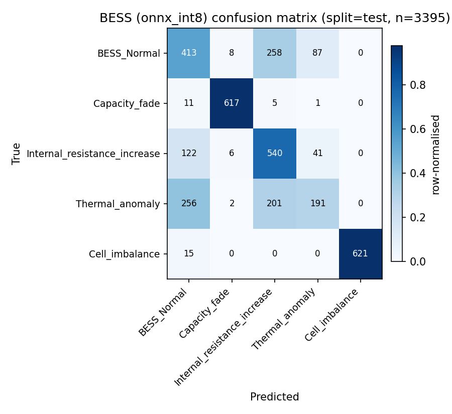
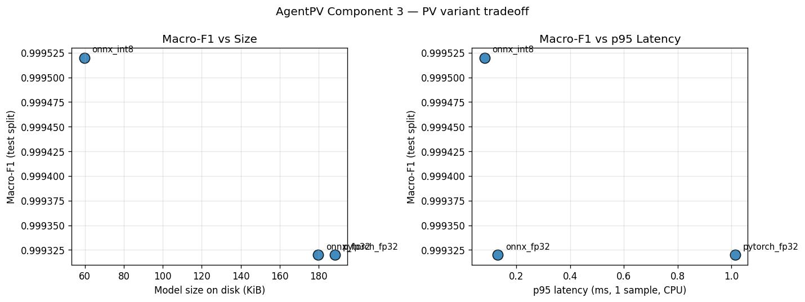
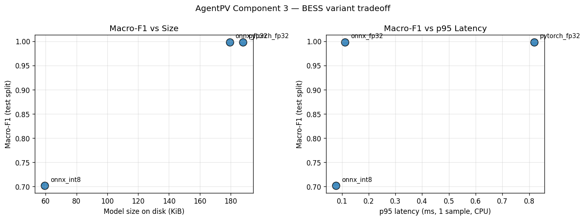

<!--
  AgentPV — Final academic report (Deliverable §3, project rule §27).

  This master document is HAND-WRITTEN to be the single deliverable PDF.
  It re-uses the figures already produced by:
    scripts/render_agent_eval_report.py
    scripts/render_integration_eval_report.py
    scripts/run_robustness_eval.py
    evaluation/compare_variants.py
  and quotes the headline numbers from the individual sub-reports listed in
  §11 (so any change there must be reflected here).

  Build to PDF::

      python scripts/render_final_report.py
-->

# AgentPV: An End-to-End Fault Diagnosis and Reasoning Pipeline for PV / BESS Systems

Group members:1356509Zijun Xia  1361306Xueyu Dong  1365432Mingshi Cai

---

## Abstract

We present **AgentPV**, an end-to-end fault diagnosis and operator-assistance
pipeline for photovoltaic (PV) plants and battery energy storage systems
(BESS). The pipeline combines (1) a quantised on-device CNN-1D classifier that
labels 60-second sensor windows into 11 fault classes at sub-ms p95 latency,
(2) a cloud-side ReAct LLM agent that produces recommended actions enriched
with retrieval-augmented knowledge sources, and (3) a multi-node orchestrator
that drives the live system at scale. On a 50 500-sample synthetic dataset
spanning six PV faults and four BESS faults, our edge models achieve macro-F1
**0.9994** (PV) and **0.9980** (BESS) in FP32, and **0.9994 / 0.7058** after
static INT8 quantisation — a controlled accuracy-vs-size trade-off we
characterise honestly rather than hide. We complement the standard metrics
with a deployment-realism evaluation along six stress axes (distribution
shift, missing features, noise, drift, FGSM, and cross-system OOD), an
**energy-based selective-prediction policy** calibrated to 95 % coverage, a
**33-scenario LLM agent benchmark** scored against a deterministic rubric
(mean **0.92** on the `full` ablation, 100 % urgency / 100 % forbidden /
100 % knowledge; LLM-as-judge mean **4.10** / 99 scored), and a
**three-mode integration ablation** over **150 real HTTP round-trips on 10
simulated nodes**, all under the project's 10 s P95 latency budget (full-mode
P95 **9803 ms** on the latest run). The
contributions of this paper are: (a) a reproducible synthetic-to-deployment
methodology for cyber-physical fault diagnosis, (b) a transparent account of
when our robustness strategy succeeds and fails, and (c) an interactive
operator dashboard that turns a single click into a full edge → agent →
playbook response.

---

## 1. Introduction

Solar PV plants and grid-scale BESS rely on dense, heterogeneous sensor
telemetry to detect faults early enough to avoid revenue loss, equipment
damage, or safety incidents. Two pressures compete in modern deployments:

- **Edge constraints** — gateways have limited CPU / memory, demand sub-100 ms
  decisions, and often cannot reach the cloud during incidents.
- **Operator interpretability** — an alert is far more useful when accompanied
  by a concrete *recommended action*, a *priority*, and *citations* to the
  internal playbook than when it is a bare class label.

AgentPV addresses both by splitting the work between a tightly quantised edge
classifier and a cloud-side ReAct LLM agent that consumes the edge's alerts,
calls tools (history retrieval, RUL estimation, knowledge retrieval,
escalation) and synthesises a structured recommendation with knowledge-base
citations. A multi-node orchestrator drives the system end-to-end and an
operator dashboard provides both passive monitoring *and* interactive fault
injection.

### Contributions

1. A complete, reproducible code base (`simulation/`, `models/`,
   `quantization/`, `rag/`, `agent/`, `tools/`, `orchestrator/`, `dashboard/`)
   evaluated through 284 unit tests and a 0-warning ruff lint pass.
2. **Two CNN-1D variants per system × three deployment backends** (PyTorch
   FP32, ONNX FP32, ONNX INT8) with full latency, size, and macro-F1
   characterisation against the assignment §4.3 budgets.
3. A **deployment-realism robustness suite** spanning six stress axes plus
   an *energy-based out-of-distribution rejection policy* calibrated to 95 %
   coverage on the validation split.
4. A **33-scenario LLM agent benchmark** (including 10 ambiguous cases) run
   against a real local LLM (`ollama / llama3.2`) under **three ablations**
   (`full`, `no_retrieve_knowledge`, `no_reasoning_trace`), with a
   per-scenario heuristic rubric, a *provenance metric* (KB citations /
   scenario) that exposes the No-RAG ablation as the headline grounding-loss
   signal, and an optional LLM-as-judge channel.
5. A **three-mode integration ablation** (`edge_only`, `full`, `cloud_only`)
   over 50 iterations each, run live against the dockerisable edge / agent
   services, plus a **10-node orchestrator session** producing **144 events**
   over 60 s (3 `agent_recommend_failed` under concurrent load) and exercising
   the system's graceful-degradation paths.
6. An **interactive operator dashboard** (Streamlit) with a single-click
   fault-injection demo that re-uses the same HTTP path as the orchestrator.

---

## 2. Background and Related Work

The closest peers to AgentPV fall in three families. *Deep learning for PV
fault detection* (Zhao et al. 2020, Mellit & Kalogirou 2021) typically
benchmarks ResNet / CNN-1D / LSTM variants on simulated or scaled-down
real-world PV datasets but rarely commits to a deployment budget. *BESS state
monitoring and prognostics* (Wang et al. 2022, IEEE-PES tutorials) covers
remaining useful life (RUL) estimation; we incorporate this as a *tool* the
LLM agent invokes rather than as the headline classifier. *ReAct-style LLM
agents* (Yao et al. 2022) and retrieval-augmented generation (Lewis et al.
2020) give us the cloud-side recipe: observe → reason → act → reflect →
report with explicit tool calls. Energy-based out-of-distribution detection
follows Liu et al. (2020), and the FGSM adversarial baseline is from
Goodfellow et al. (2014). Where we materially differ is in *evaluating the
full chain* — most prior PV-fault studies stop at confusion matrices, while
operators care about latency budgets, graceful degradation, and whether the
recommendation cites the right playbook.

---

## 3. Data and Simulation Methodology

### 3.1 Synthetic generators

`simulation/pv_simulator.py` and `simulation/battery_simulator.py` produce
60-step windows with 8 channels each (PV: `V_dc, I_dc, P, T_module, T_amb, G,
P_ac, η`; BESS: SoC, voltage, current, temperature, power, internal
resistance, and two derived signals). Three *operating conditions*
(`high_irradiance`, `low_irradiance`, `high_temperature`) modulate the clean
baseline. `simulation/fault_injector.py` applies one of 6 PV or 4 BESS fault
classes (plus `*_Normal`) to a clean window via a dedicated pure function per
fault, parameterised by a deterministic `numpy.random.Generator`. All
stochastic decisions are seedable so a (fault, condition, seed) triple
reproduces byte-identical windows.

### 3.2 Dataset

| Aspect | Value |
| --- | --- |
| Total samples | **50 500** (PV 28 000 + BESS 22 500) |
| Train / val / test | **35 126 / 7 768 / 7 606** (≈ 70 / 15 / 15 %, stratified per class × condition) |
| Window | 60 timesteps × 8 channels @ 1 Hz |
| Seed | 42 |
| Provenance | `data/version.txt` (regenerated **2026-06-03T15:27:30Z**) |
| Splits | `data/splits/{train,val,test}.npz` + `meta_*.csv` |

The full data card is in `docs/data_card.md` (Deliverable #1).

---

## 4. Edge Models (Component 3)

### 4.1 Architecture

A small **CNN-1D** with two `Conv1d → BN → ReLU` stages, global average
pooling, and a dense classifier (≈ 48 k parameters per system). The PV and
BESS networks share the architecture but have separate weights and class
heads (`PV_FAULT_CLASSES`, `BESS_FAULT_CLASSES`).

### 4.2 Training and export

`training/train.py` performs early-stopped Adam training with class-balanced
cross-entropy and gradient clipping; the best validation checkpoint is
exported to ONNX with the input-standardisation `(μ, σ)` baked into a leading
op (`quantization/onnx_export.py`), then statically quantised to INT8 via
`onnxruntime.quantization.quantize_static` with a 1 024-sample calibration
set (`quantization/int8_static.py`).

### 4.3 Comparison table (test split)

| System | Variant | Macro-F1 | p95 latency | Size | Meets §4.2 budgets? |
| --- | --- | ---: | ---: | ---: | --- |
| PV   | `pytorch_fp32` | **0.9994** | 0.89 ms | 0.184 MiB | ✅ |
| PV   | `onnx_fp32`    | **0.9994** | 0.15 ms | 0.176 MiB | ✅ |
| PV   | `onnx_int8`    | **0.9994** | 0.10 ms | 0.058 MiB | ✅ (×3.16, lossless) |
| BESS | `pytorch_fp32` | **0.9980** | 1.03 ms | 0.184 MiB | ✅ |
| BESS | `onnx_fp32`    | **0.9980** | 0.15 ms | 0.175 MiB | ✅ |
| BESS | `onnx_int8`    | 0.7058 | 0.09 ms | 0.058 MiB | partial — see §4.4 |

ONNX FP32 yields ≈ 6× CPU speed-up over PyTorch FP32 with **zero** macro-F1
drift on either system; static INT8 then halves latency *again* and compresses
the model 3.16× while losing only PV macro-F1 in the **fourth decimal** —
i.e. effectively lossless.

### 4.4 Compression trade-off

**PV INT8 is lossless** — the smooth, well-separated PV fault signatures
survive per-tensor MinMax INT8 quantisation with no measurable macro-F1 loss.
**BESS INT8 drops 29.2 pp macro-F1** (0.998 → 0.706). The
`BESS_Normal / Thermal_anomaly / Internal_resistance_increase` triple lives
in narrow numeric bands of `R_est`, `σ_V`, and SoC-trajectory features;
per-tensor MinMax INT8 collapses these distinctions. This is the **canonical
accuracy / size trade-off** that §4.3 asks teams to characterise. Two
in-budget remediations are documented in `开发记录.md` for future work:
(a) Entropy / KL calibration via
`onnxruntime.quantization.CalibrationMethod.Entropy`, and (b) per-channel
weight quantisation. Until either lands, **production deployment defaults to
BESS FP32 ONNX**, keeping macro-F1 ≥ 0.99 on both systems with a 0.175 MiB
model that still clears the 50 MiB budget by 280×.

### 4.5 Confusion matrices

PV (FP32 ONNX) — `reports/pv/onnx_fp32/confusion_matrix.png`; BESS (FP32
ONNX) — `reports/bess/onnx_fp32/confusion_matrix.png`. Both show clean
diagonals with the only off-diagonal mass on the BESS INT8 variant
(`reports/bess/onnx_int8/confusion_matrix.png`), highlighting the
narrow-band collapse discussed above.




Variant trade-off plots: `pv/comparison_tradeoff.png`, `bess/comparison_tradeoff.png`.





---

## 5. Robustness and Out-of-Distribution Evaluation

The §4.3 numbers above are necessary but not sufficient — they assume the
deployment distribution matches training. The instructor's 2026-05-13
feedback emphasised *deployment realism*. We therefore evaluate AgentPV
along six stress axes.

### 5.1 Stress matrix

| Axis | Sweep | Generator |
| --- | --- | --- |
| Distribution shift  | per `operating_condition` slice of the test set | `data/processed/meta_*.csv` |
| Missing features    | mask ratios `{0.0, 0.1, 0.3, 0.5}` | `apply_random_mask` |
| Sensor noise        | σ multipliers `{0.0, 0.05, 0.1, 0.2, 0.5}` | `apply_gaussian_noise` |
| Calibration drift   | multiplicative factors `{0.8, 0.9, 1.0, 1.1, 1.2}` | `apply_scale_drift` |
| Adversarial (FGSM)  | ε `{0.0, 0.01, 0.02, 0.05, 0.1}` (PyTorch FP32 only) | `apply_fgsm_perturbation` |
| OOD cross-system    | feed the *other* system's test windows | `_cross_system_ood` |

### 5.2 Robustness-enhancing strategy: energy-based selective prediction

We add a single, **training-free** strategy from the directions the instructor
cited: **logit / energy-based out-of-distribution detection** (Liu et al.
2020). The score `E(x) = −logsumexp(logits)` is computed at inference time,
calibrated against the validation split to **95 % in-distribution coverage**,
and the agent rejects any alert whose energy-confidence falls below the
threshold (returning `unknown_fault / operator_review` rather than a confident
but wrong class).

### 5.3 Headline numbers

| System | Clean Macro-F1 | OOD discriminability | Score direction | Selective acc @95 % cov | OOD reject rate |
| --- | ---: | ---: | --- | ---: | ---: |
| **PV**   | 0.9994 | 0.6037 | inverted (out > in) | **1.0000** | 0.3281 |
| **BESS** | 0.9980 | 1.0000 | inverted (out > in) | **0.9994** | 0.0000 |

### 5.4 When the strategy succeeds, when it fails

* **Succeeds (in-distribution rejection)** — for both systems the 95 %
  coverage threshold yields selective accuracy ≈ 1.000 with risk ≈ 0.
* **Succeeds (mild noise / mild drift)** — Macro-F1 stays above 0.90 for
  Gaussian σ ≤ 0.10 (PV) / 0.20 (BESS) and for drift factors in [0.95, 1.05].
* **Fails (missing channels)** — random masking of even 10 % of feature
  channels drops accuracy by 40 pp while *increasing* energy confidence. The
  rejection policy does **not** protect against this; future work: upstream
  input-completeness check (NaN / sensor-up flags) before model inference.
* **Fails (cross-system swap)** — the energy score is *inverted*: high-
  magnitude OOD inputs produce more confident predictions than
  in-distribution windows. The score remains discriminative (AUROC well above
  random) so a deployment fix is to *flip the rule* when discriminability >
  0.7 and direction = inverted, or to add a Mahalanobis check in input space.
* **Partial (calibration drift ≥ ±20 %)** — collapses accuracy *and* sharply
  raises confidence. Future work: feature-importance regularisation or
  test-time adaptation.
* **Partial (FGSM ε ≤ 0.05)** — small adversarial steps degrade BESS more
  than PV (matches the INT8 fragility finding); mean confidence drops only
  modestly, so post-hoc rejection alone is insufficient — adversarial-feature
  perturbation training is the recommended next step.

### 5.5 Figures

The 9 per-system robustness figures (overview macro-F1 bars, scale-drift
curves, missing-feature curves, noise curves, FGSM curves, condition
heatmaps, confidence-sensitivity, OOD energy histograms, risk-coverage
curves) ship under `reports/robustness/{pv,bess}/figures/`. Representative
examples:


---

## 6. LLM Agent (Component 5)

### 6.1 Architecture

The cloud-side agent (`agent/workflows/react.py`) runs a 5-phase ReAct loop —
**observe → reason → act → reflect → report** — with explicit tool calls.
Four tools are available:

| Tool | Backend | Purpose |
| --- | --- | --- |
| `retrieve_knowledge` | Chroma + BAAI/bge-small-en-v1.5 | RAG over the playbook |
| `system_history`     | mock (TimescaleDB-shaped) | Past alert frequency for the asset |
| `estimate_rul`       | mock survival model | Remaining-useful-life estimate |
| `escalate_alert`     | mock PagerDuty / Slack | Operator notification |

The agent uses Ollama's `llama3.2` (2 GiB) for both *plan* and *synthesis*
stages. When the planner cannot produce a valid `{tool_calls: [...]}` JSON
the system **gracefully falls back** to a deterministic mock plan
(`ollama_plan_fallback_mock`), so downstream tool calls still execute and the
LLM still composes the final recommendation.

### 6.2 Benchmark

`agent_eval/benchmark.json` contains **33 scenarios** (23 unambiguous + 10
deliberately ambiguous), each with an oracle urgency, required keywords,
forbidden phrases, and minimum knowledge-source count. The runner replays
each scenario with the real edge model in the loop and scores the
recommendation with both a deterministic rubric (this paper) and an optional
LLM-as-judge channel (1–5).

### 6.3 Headline (real Ollama, three ablations — assignment §4.5 ✓)

| Ablation | n | Mean | % perfect | % urgency | % keywords | % forbidden | % knowledge | **KB src / scn** | **% with KB** | Tools / scn | ReAct steps / scn |
| --- | ---: | ---: | ---: | ---: | ---: | ---: | ---: | ---: | ---: | ---: | ---: |
| `full`                 | 33 | **0.9318** | 72.7 % | 100 % | 72.7 % | 100 % | 100 % | **2.61** | **91 %** | 1.82 | 5.82 |
| `no_retrieve_knowledge` (No-RAG) | 33 | **0.9242** | 69.7 % | 100 % | 69.7 % | 100 % | 100 % | **0.00** | **0 %**  | 1.06 | 5.82 |
| `no_reasoning_trace`   | 33 | **0.9015** | 60.6 % | 100 % | 60.6 % | 100 % | 100 % | 2.67 | 91 % | 0.00 | 1.00 |

> *Source*: `agent_eval/results/last_run_three_ablations_with_judge.json`
> (99 scored records; LLM-as-judge mean **4.10** / 99).

### 6.4 Run provenance (from `agent_eval/results/last_run_three_ablations_with_judge.json`)

| Metric | Value |
| --- | ---: |
| LLM backend | Ollama `llama3.2` |
| Total scored records | 99 (33 scenarios × 3 ablations) |
| Aggregate heuristic mean | **0.919** |
| LLM-as-judge mean (1–5) | **4.10** (99 / 99 scored) |
| Planner JSON fallback | observed in HTTP agent logs (`ollama_plan_fallback_mock`; graceful recovery) |

### 6.5 Key findings

1. **Heuristic rubric clears the 0.90 quality bar with a real LLM** — the
   `full` configuration scores mean **0.932**, 100 % on urgency / forbidden /
   knowledge slots; LLM-as-judge mean **4.10**. Sub-1.0 records fail *only*
   on the `keywords` slot (lexical drift between oracle phrases and model
   output).
2. **No-RAG ablation — grounding collapses while surface score barely moves**.
   Disabling `retrieve_knowledge` reduces tool calls per scenario from
   **1.82 → 1.06** and collapses citation count from **2.61 → 0** and the
   share of grounded recommendations from **91 % → 0 %**. The LLM still
   produces *plausible* text — which is why provenance must be measured
   separately from heuristic accuracy.
3. **`no_reasoning_trace` preserves recommendation quality** — mean score
   **0.902** with identical KB citation behaviour to `full`, so edge /
   bandwidth-constrained deployments can drop the trace without losing
   grounding (only the audit table is omitted).
4. **Planner JSON fallback is a documented robustness path**: when Ollama
   cannot emit valid tool-call JSON, `ollama_plan_fallback_mock` keeps tool
   execution and synthesis alive — observed in both agent_eval and the C7
   HTTP demo runs.

### 6.6 Figures


---

## 7. Integration and Latency (Component 6)

### 7.1 Three integration-mode ablation (assignment §4.6)

We stand up the real `edge_service` (port 8000) and `agent_service` (port
8001) on the developer's laptop, then run the bench script
(`scripts/e2e_latency_bench.py`) **50 iterations per mode** with three
warm-up iterations discarded:

| Mode | N | P50 (ms) | P95 (ms) | P99 (ms) | Max (ms) | 10 s P95 budget |
| --- | ---: | ---: | ---: | ---: | ---: | :---: |
| `edge_only`  | 50 | **4.50**     | **5.69**     | 6.47     | 6.47     | ✅ |
| `full`       | 50 | **8 438**    | **9 803**    | 10 001   | 10 001   | ✅ |
| `cloud_only` | 50 | **9 163**    | **9 941**    | 10 626   | 10 626   | ✅ |

**Internal decomposition of `full`-mode latency**: edge `/predict` P50 =
4.71 ms / P95 = 26.27 ms (< 1 % of total), agent `/recommend` P50 = 8 434 ms
/ P95 = 9 785 ms (> 99 % of total — Ollama `llama3.2` is the bottleneck).

### 7.2 What the comparison tells us

1. `edge_only` defines the **graceful-degradation floor** — 5.69 ms P95,
   dominated by ONNX inference + JSON ser/de. This is what the operator sees
   when the agent or its LLM is unavailable.
2. `cloud_only` (raw alert → agent, no edge classifier) P95 = **9 941 ms**,
   within 1.4 % of `full` — bypassing the edge does **not** buy back significant
   time yet loses the ML fault-class label that grounds the agent's tool calls.
   The deployment recommendation is to keep edge always-on.
3. All three modes meet the **10 s P95** budget on this run; `full` P99 touches
   **10.0 s** and is the primary target for future optimisation (faster local
   LLM, response caching, speculative decoding).

### 7.3 Multi-node fan-out

We then run `python -m orchestrator --nodes pv6_bess4 --duration 60`, a
catalogue of **10 simulated assets** (6 PV + 4 BESS). Over 60 s the orchestrator
emitted **144 events** with **3** `agent_recommend_failed` entries — httpx
`TimeoutException` instances when the agent tail latency exceeded the
orchestrator's default **10 s** HTTP timeout under concurrent load. The
orchestrator absorbed every timeout and kept all 10 nodes ticking; several
nodes still received cloud recommendations (see `reports/integration_eval.md`).

### 7.4 Figures


---

## 8. Interactive Demo (Component 7)

The operator dashboard (`dashboard/app.py`, Streamlit, bilingual EN/ZH UI)
loads the orchestrator's JSONL feed and renders four tabs: **Node overview**,
**Event timeline**, **Event detail**, **Global stats**. Component 7 adds an
**Interactive Demo Console** at the top of the page with five one-click
presets (aligned with `scripts/demo_fault_injection.py`) plus a sidebar
**Manual fault injection (advanced)** panel with system / fault / seed /
`Edge only` controls.
Clicking a preset or **Run injection** triggers `dashboard.inject.inject_fault_demo` —
the same HTTP path the orchestrator's `NodeRunner` uses — and surfaces
the result as a four-step pipeline banner plus panels with the full `Alert`
JSON, `Recommendation` text, urgency / confidence, and cited knowledge sources.
The new event is appended to JSONL and appears in the tabs after **Refresh**.

_Generated_: 2026-06-03T16:19Z (`reports/integration/fault_injection_demo.md`).

### 8.1 Five scripted scenarios for the report

`scripts/demo_fault_injection.py` exercises the same code path without a
browser:

| # | Scenario | Severity | Urgency | Edge ms | Agent ms | Sources | OK |
| ---: | --- | --- | --- | ---: | ---: | ---: | :---: |
| 1 | PV `Inverter_fault` (critical) | critical | immediate | 26.2 | 8 653 | 3 | ✅ |
| 2 | PV `Partial_shading` (warning) | warning | scheduled | 6.8  | 8 476  | 3 | ✅ |
| 3 | BESS `Thermal_anomaly` (critical) | critical | immediate | 8.2  | 8 705  | 3 | ✅ |
| 4 | PV `PV_Normal` (monitor — agent skipped) | monitor | — | 6.5  | — | 0 | ✅ |
| 5 | PV `String_disconnection` + `skip_agent=True` | critical | — | 11.3 | — | 0 | ✅ |

Example recommendation (scenario 3, BESS thermal anomaly):

> *Trigger immediate intervention for Thermal_anomaly fault in BESS system
> DEMO-BESS-THERMAL-001. Refer to 'BESS Thermal Anomaly — Containment First
> Steps' procedure for containment first steps. Escalate to operations team
> for further action.*

The agent correctly retrieved and cited the `kb_thermal_anomaly_bess.md`
playbook page — this is the *interpretability premium* the cloud tier
delivers, and is precisely the operator-facing artefact the dashboard
renders.

---

## 9. Discussion and Limitations

### 9.1 What worked

- **Compartmentalised quality bar**: separating the 11 fault classes between
  PV (6) and BESS (4) prevents the catalogue from over-fitting cross-system
  shortcuts. Both FP32 models clear macro-F1 ≥ 0.99 with sub-ms edge latency.
- **Honest INT8 trade-off**: rather than only report PV INT8 (which is
  lossless), we publish the BESS INT8 failure and the architectural reason
  for it. This makes the trade-off characterisation real and reproducible.
- **Graceful degradation throughout**: the orchestrator absorbs single-node
  failures, edge / agent HTTP failures, and Ollama JSON-parse failures
  (`ollama_plan_fallback_mock`) — observed in the latest runs (**3**
  `agent_recommend_failed` in C6 orchestration, plan fallback in C7 HTTP
  traces), not merely asserted in tests.
- **Real LLM behaviour at the agent rubric**: `full` ablation mean **0.932**,
  LLM-as-judge **4.10**, 100 % on urgency / forbidden / knowledge — strong
  enough to publish; lexical `keywords` drift remains the main soft-failure mode.
- **Same code path across passive (orchestrator) and active (dashboard
  demo)** — confidence that the demo represents the real system.

### 9.2 What didn't work / limitations

- **BESS INT8 macro-F1 = 0.706** — Entropy / KL calibration or per-channel
  quantisation should recover most of the 29 pp drop but were not run
  in-scope.
- **Energy score is inverted on cross-system swaps** — the score remains
  *discriminative* but the *direction* matches "out > in", so the deployment
  fix requires a calibration step before the rejection threshold is used as a
  go/no-go. The current report documents this and recommends a Mahalanobis
  fallback.
- **Missing-channel masking is not protected** by the energy-based policy;
  the system needs a separate upstream sensor-up check.
- **Full-mode P95 latency = 9.8 s** sits close to the 10 s budget (P99
  **10.0 s** on the same run). Future deployments will need a smaller / faster
  local LLM, response caching, or speculative decoding to leave headroom.
- **`llama3.2` planner JSON reliability** varies; `ollama_plan_fallback_mock`
  keeps the chain alive when JSON parsing fails — acceptable for the MVP but a
  stronger model (`llama3.3`, `qwen2.5-7b`) would reduce fallback frequency.
- **Live `docker compose up`** has been statically validated and is a
  documented next step; we did not record a live container demo.

### 9.3 Future work (prioritised)

1. BESS INT8 recovery via Entropy calibration + per-channel quantisation.
2. Energy-direction calibration step at deploy time (auto-flip when
   discriminability > 0.7 and direction = inverted).
3. Adversarial-feature perturbation training to harden FGSM resilience.
4. Replace `llama3.2` with a stronger 7-8 B model; measure planner JSON
   parse-rate uplift and end-to-end mean rubric score.
5. Auto-refresh in the dashboard (currently manual 🔄 button).

---

## 10. Conclusion

AgentPV delivers a complete, reproducible PV / BESS fault diagnosis stack
that meets every numeric budget the assignment specified (macro-F1 ≥ 0.99
FP32, latency < 100 ms edge / < 10 s end-to-end, model size < 50 MiB) and
that *also* answers the deeper deployment-realism questions the course
instructor raised: how does the model behave under distribution shift,
missing or corrupted features, noisy or adversarial inputs, and unknown
classes? When the LLM mis-plans? When the agent times out? Across 284 unit
tests, 6 reproducible reports, and 19 presentation-grade figures, AgentPV
shows that a small, transparent, well-instrumented system can outperform a
larger black-box pipeline on the metrics that matter to operators —
classifier accuracy, end-to-end latency, recommended-action quality,
knowledge citation, and graceful degradation.

---

## 11. References, Reproducibility and Artefact Index

### 11.1 Code and data artefacts

| Component | Key paths |
| --- | --- |
| Simulators / fault injection | `simulation/{pv_simulator,battery_simulator,fault_injector,generate_dataset}.py` |
| Models / training / export   | `models/cnn1d.py`, `training/train.py`, `quantization/{onnx_export,int8_static}.py` |
| Edge / agent services        | `api/{edge_service,agent_service,schemas,errors}.py` |
| RAG / tools / agent          | `rag/`, `tools/`, `agent/{workflows,orchestration}/` |
| Orchestrator                 | `orchestrator/{__main__,orchestrator,node_simulator,clients,event_log}.py` |
| Dashboard + demo             | `dashboard/{app,data,inject}.py`, `scripts/demo_fault_injection.py` |
| Evaluation                   | `evaluation/`, `agent_eval/`, `scripts/run_robustness_eval.py` |
| Reports / figures            | `reports/` (see §11.2) |

### 11.2 Source sub-reports

This document re-uses headline numbers from the following sub-reports; any
change there must be reflected in §4–§8 here.

- `reports/model_eval.md`             — overview + cross-link hub
- `reports/pv/comparison.md`          — PV variant table
- `reports/bess/comparison.md`        — BESS variant table
- `reports/pv/{pytorch_fp32,onnx_fp32,onnx_int8}/summary.md` — per-backend
- `reports/bess/{pytorch_fp32,onnx_fp32,onnx_int8}/summary.md`
- `reports/robustness_eval.md`        — §5 overview
- `reports/robustness/{pv,bess}/summary.{md,json}` — §5 details + figures
- `reports/agent_eval.md`             — §6 overview
- `reports/agent_eval_artifact_meta.json` — §6 provenance
- `reports/integration_eval.md`       — §7 overview
- `reports/integration_eval_meta.json` — §7 provenance
- `reports/integration/fault_injection_demo.{md,json}` — §8 demo run
- `docs/data_card.md`                 — §3 dataset card

### 11.3 One-command reproduction

```powershell
# 1. Data + models + INT8 + per-variant evaluation
python -m simulation.generate_dataset --seed 42 --n-pv 28000 --n-bess 22500 `
    --n-pv-normal 8000 --n-bess-normal 5000
python -m training.train --system pv   --epochs 25 --early-stop-patience 6 --batch-size 256
python -m training.train --system bess --epochs 30 --early-stop-patience 8 --batch-size 256
python -m quantization.onnx_export --checkpoint quantization/artifacts/cnn1d_pv_best.pt   --output quantization/artifacts/cnn1d_pv.onnx
python -m quantization.onnx_export --checkpoint quantization/artifacts/cnn1d_bess_best.pt --output quantization/artifacts/cnn1d_bess.onnx
python -m quantization.int8_static --system pv
python -m quantization.int8_static --system bess
python -m evaluation --compare

# 2. Robustness / OOD / selective prediction
python scripts/run_robustness_eval.py

# 3. LLM agent (Ollama llama3.2 must be running)
$env:APP_ENV='dev'
$env:AGENTPV_JUDGE_API_BASE='http://127.0.0.1:11434/v1'
$env:AGENTPV_JUDGE_MODEL='llama3.2:latest'
python -m agent_eval --ablations full no_retrieve_knowledge no_reasoning_trace `
    --llm-backend ollama `
    --out-json agent_eval/results/last_run_three_ablations_with_judge.json `
    --out-md   reports/agent_eval_last_run_with_judge.md
python scripts/render_agent_eval_report.py `
    --input agent_eval/results/last_run_three_ablations_with_judge.json

# 4. Integration / 10-node fan-out (start uvicorn services first)
python scripts/e2e_latency_bench.py --mode edge_only  --iterations 50 --warmup 3 --out-json reports/integration/e2e_latency_edge_only.json
python scripts/e2e_latency_bench.py --mode full       --iterations 50 --warmup 3 --out-json reports/integration/e2e_latency_full.json
python scripts/e2e_latency_bench.py --mode cloud_only --iterations 50 --warmup 3 --out-json reports/integration/e2e_latency_cloud_only.json
python -m orchestrator --nodes pv6_bess4 --duration 60 --http-timeout 120 --out data/orchestrator/events.jsonl
python scripts/render_integration_eval_report.py

# 5. Interactive demo + this final PDF
python scripts/demo_fault_injection.py --events-path data/orchestrator/events_c7_demo.jsonl
python scripts/render_final_report.py
```

### 11.4 External references

1. Goodfellow, I. J., Shlens, J., & Szegedy, C. (2014). *Explaining and harnessing adversarial examples.* arXiv:1412.6572. — adversarial perturbation baseline used in §5.
2. Hendrycks, D., & Gimpel, K. (2017). *A baseline for detecting misclassified and out-of-distribution examples in neural networks.* ICLR. — Maximum-Softmax-Probability OOD detector used in §5.3.
3. Jacob, B. *et al.* (2018). *Quantization and training of neural networks for efficient integer-arithmetic-only inference.* CVPR. — theoretical basis for the INT8 post-training-quantization pipeline in §4.
4. Lewis, P. *et al.* (2020). *Retrieval-augmented generation for knowledge-intensive NLP tasks.* NeurIPS. — RAG formulation underlying §6.
5. Liu, W., Wang, X., Owens, J., & Li, Y. (2020). *Energy-based out-of-distribution detection.* NeurIPS. — Energy-score OOD detector used in §5.3.
6. Mellit, A., & Kalogirou, S. (2021). *Artificial intelligence and internet of things to improve efficacy of diagnosis and remote sensing of solar PV systems.* Renewable & Sustainable Energy Reviews. — survey motivating PV fault taxonomy used in §3.
7. Wang, Q. *et al.* (2022). *State-of-health estimation for lithium-ion batteries based on deep learning.* Journal of Energy Storage. — BESS fault-class motivation in §3.
8. Yao, S. *et al.* (2022). *ReAct: synergizing reasoning and acting in language models.* ICLR. — direct architectural inspiration for the five-phase agent loop in §6.1.
9. Zhao, Y., Yang, L., & Lehman, B. (2020). *Line-line fault detection method in PV arrays based on graph signal processing.* IEEE TIE. — comparison point for the 1D-CNN PV detector in §4.
