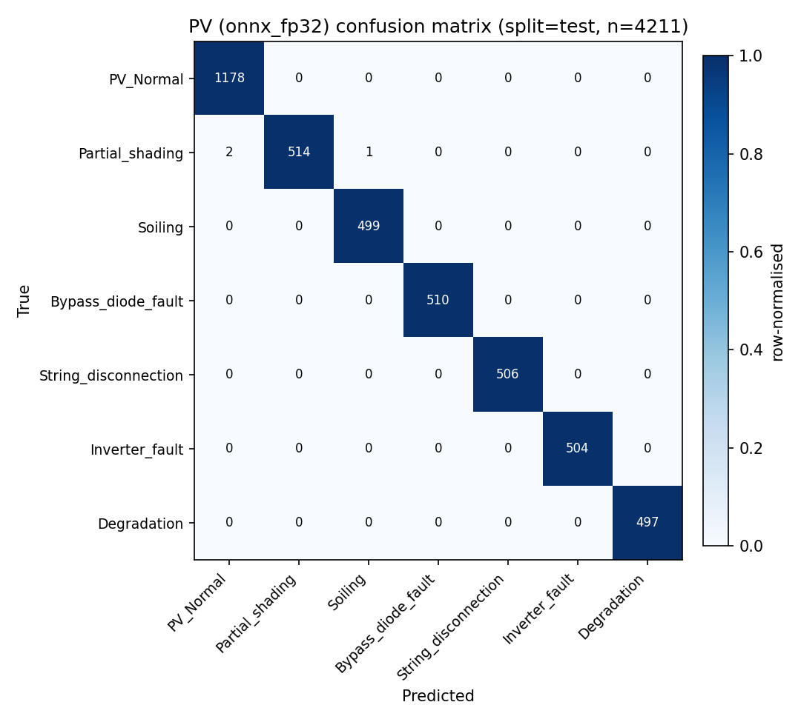

# AgentPV Component 3 — PV `onnx_fp32` evaluation summary

- **Variant**: `onnx_fp32`
- **Model artefact**: `C:\Users\Mansycc\Desktop\omar\quantization\artifacts\cnn1d_pv.onnx`
- **Split**: `test`
- **Samples**: 4211
- **Classes**: 7

## Aggregate metrics

- Accuracy: **0.9993**
- Macro-F1: **0.9993** ✅ ≥ 0.90 target met
- Weighted-F1: 0.9993

### PV classification report — split=`test` (N=4211, n_classes=7)

| Class | Precision | Recall | F1 | Support |
|---|---:|---:|---:|---:|
| `PV_Normal` | 0.9983 | 1.0000 | 0.9992 | 1178 |
| `Partial_shading` | 1.0000 | 0.9942 | 0.9971 | 517 |
| `Soiling` | 0.9980 | 1.0000 | 0.9990 | 499 |
| `Bypass_diode_fault` | 1.0000 | 1.0000 | 1.0000 | 510 |
| `String_disconnection` | 1.0000 | 1.0000 | 1.0000 | 506 |
| `Inverter_fault` | 1.0000 | 1.0000 | 1.0000 | 504 |
| `Degradation` | 1.0000 | 1.0000 | 1.0000 | 497 |

| Aggregate | Value |
|---|---:|
| Accuracy | 0.9993 |
| Macro-F1 | **0.9993** |
| Weighted-F1 | 0.9993 |

## Confusion matrix

## CPU latency benchmark

- Runs: 1000 (warm-up 50, batch=1)
- Mean: 0.110 ms
- p50: 0.110 ms
- p95: **0.132 ms** ✅ ≤ 100 ms
- p99: 0.145 ms
- min / max: 0.079 ms / 1.020 ms

## Model size

- File: `C:\Users\Mansycc\Desktop\omar\quantization\artifacts\cnn1d_pv.onnx`
- Size: 179.85 KiB (0.1756 MiB)
- Budget: 50 MiB — ✅ within budget